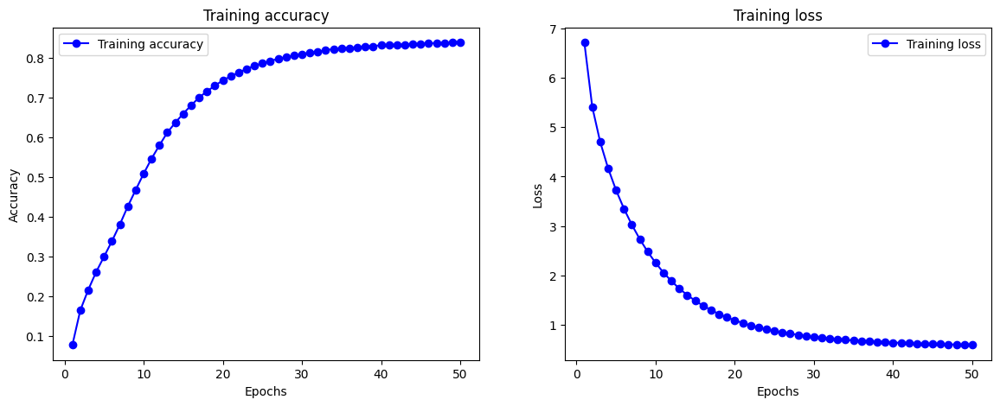

# RentBy Machine Learning
<br />
Repository for Bangkit 2023 Capstone project. <br />

## What's RentBy?
RentBy is a mobile application, offers a solution to Indonesia's high stress rates, which often hinder engagement in hobbies due to financial constraints, particularly in activities like hiking and cosplaying. By integrating machine learning and collaborative consumption principles, RentBy revolutionizes access to specialized items, such as hiking gear and cosplay costumes. This innovation eliminates financial barriers to hobby participation by enabling users to rent these items from peers. 

## Our Model
RentBy has a machine learning model icluded within the search bar feature, we utilize a Natural Language Processing model to help give recommendations of keywords for users to tap and search for time and effort efficiency. We also used the same model to get weights of each word from both inputs and product names and compare it using cosine similarity.

Our word predictor was trained using 9000+ products from 10+ different product groups, and reached 83% training accuracy.<br />
<br /><br />


## Word Prediction Model and Keyword-Product Similarity

### Dataset
Dataset Link: https://github.com/Rentby/rentby-machine-learning/blob/main/data/rentby_dataset.csv

### Requirements
To run the notebook and utilize the model, the following dependencies are required:
- Tensorflow
- Matplotlib
- Pandas
- NumPy
- Scikit-learn
- os

### Steps
1. Clone the repository.
```bash
git clone https://github.com/Rentby/rentby-machine-learning.git
```
2. Install the required dependencies.
```bash
pip install tensorflow matplotlib numpy pandas sklearn
```
3. Navigate to the model directory and open the notebooks.
4. Run the cells in the notebook to train the model and evaluate its performance.
5. The train model will be saved automatically if you provide the checkpoint callback.
6. Optional: You can use a provided cell below training cell, to test the output of the model.
7. Use the saved model for inference in your applications.
8. Optional: Run the cell in the notebook to build a function that can generate datasets embedding. The same cell will also build a product recommender function using cosine similarity of the embedded input text and the embedded collection of product names.
